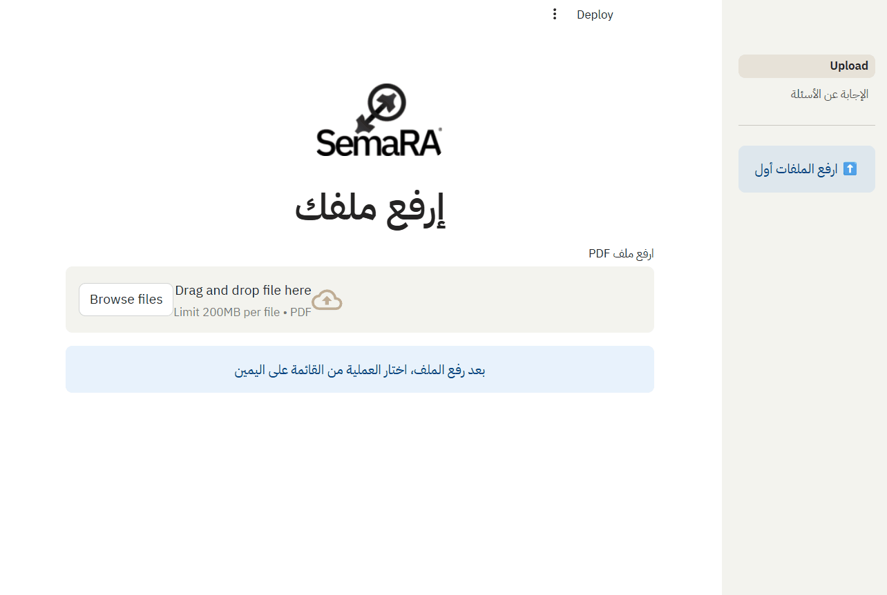
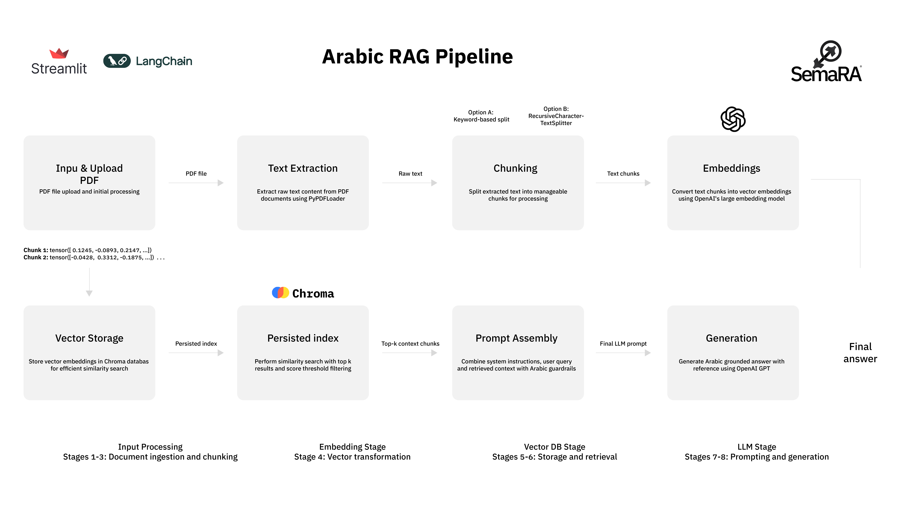

# SemaRA – Arabic RAG Pipeline (Local-First)

> Search Arabic PDFs with AI – fast, private, accurate.



## نظرة عامة

- النظام عبارة عن RAG System مخصص لمعالجة واسترجاع المعلومات من ملفات PDF باللغة العربية  
- الفئة المستهدفة تشمل مستخدمين لديهم مستندات عربية ضخمة  
- يعتمد على طريقتين للتقسيم لتحسين جودة الاسترجاع  
- يستخدم OpenAI Embeddings لإنشاء تمثيلات عالية الدقة للنصوص العربية  
- التخزين يتم في Chroma vectordatabase محلياً لزيادة الخصوصية  
- البحث يعتمد على Approximate Nearest Neighbors - ANN لاسترجاع المقاطع الأكثر صلة بالكويري  
- معالجة الإجابة النهائية عن طريق gpt-4o  
- الواجهات ورفع الملفات عن طريق streamlit  


##  معمارية النظام


##   جربه الحين!
```bash
git clone ...
pip install -r requirements.txt
streamlit run app.py